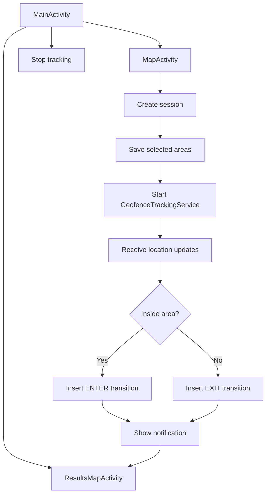
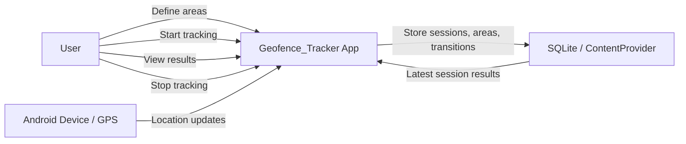
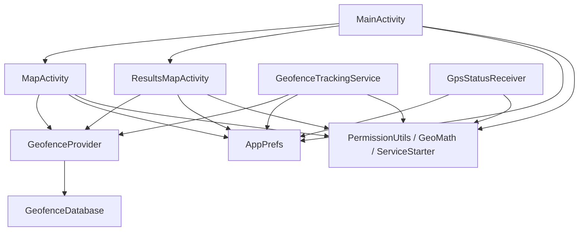
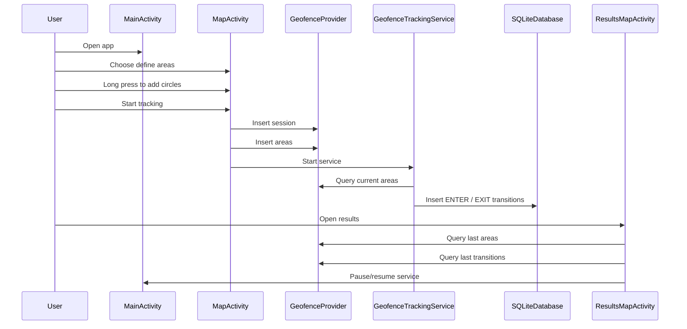
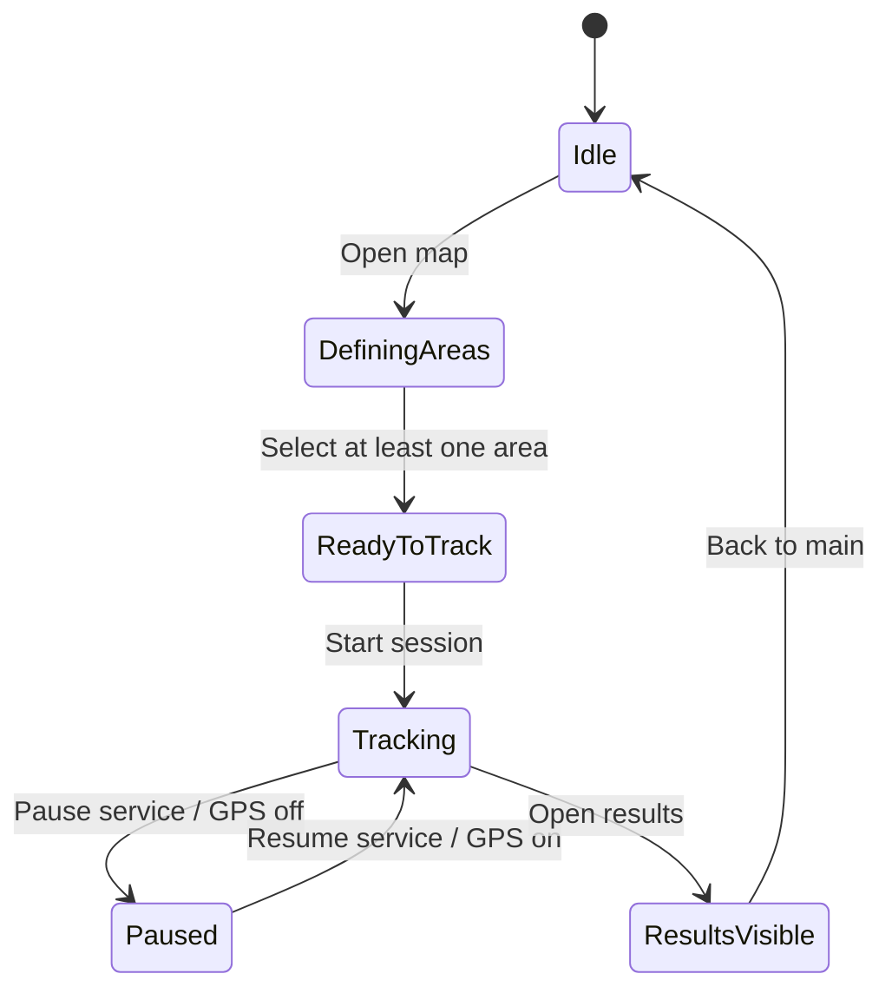
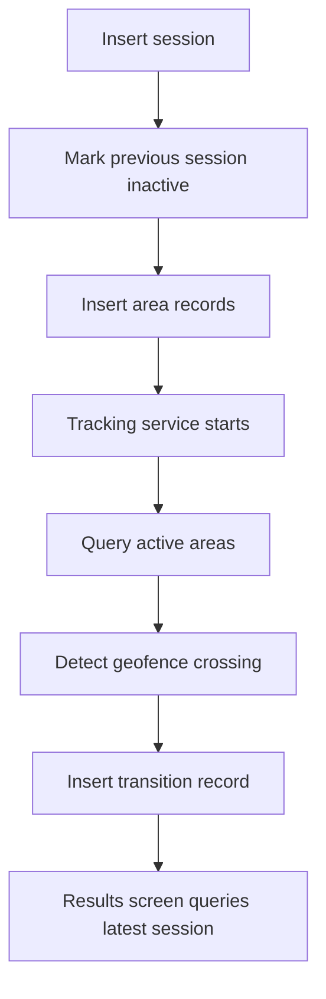

# Geofence_Tracker Project Documentation

## Overview

Geofence_Tracker is an Android app written in Java that lets a user define circular geofence areas, start location tracking, detect entry and exit transitions, and review the latest session results on a map.

The project is organized as a small but complete Android application with:

- a main screen for navigation and tracking control
- a map screen for defining geofence areas
- a results screen for reviewing saved geofence activity
- a SQLite-backed content provider for sessions, areas, and transitions
- a foreground location service for geofence monitoring
- a few utility classes for permissions, math, and app preferences
- emulator and provider-based tests for core behavior

## What The App Does

At a high level:

1. The user opens the app.
2. The user creates one or more circular geofence areas on the map.
3. The user starts tracking.
4. The foreground service listens for location changes.
5. When the device moves into or out of a selected area, the app stores a transition in the database.
6. The results screen shows the latest session’s areas and transition markers.

## Project Structure

### `MainActivity`

File:

- [MainActivity.java](C:\Users\elvis\AndroidStudioProjects\android-geofence-java\app\src\main\java\com\example\geofenceapp\MainActivity.java)

What it does:

- Acts as the landing screen
- Requests foreground location permission when needed
- Navigates to the map screen and results screen
- Stops active tracking sessions
- Shows a small status area so the user can see the current state

### `MapActivity`

File:

- [MapActivity.java](C:\Users\elvis\AndroidStudioProjects\android-geofence-java\app\src\main\java\com\example\geofenceapp\MapActivity.java)

What it does:

- Shows the Google Map where the user defines geofence areas
- Long press adds a 100 meter circle
- Long press inside an existing circle removes it
- Saves the selected areas as part of a new session
- Starts the tracking service

### `ResultsMapActivity`

File:

- [ResultsMapActivity.java](C:\Users\elvis\AndroidStudioProjects\android-geofence-java\app\src\main\java\com\example\geofenceapp\ResultsMapActivity.java)

What it does:

- Shows the latest saved session on a map
- Draws saved geofence circles
- Places enter/exit markers for the latest session
- Shows the current device location when available
- Lets the user pause or resume the tracking service
- Shows an empty state when there are no results yet

### `GeofenceTrackingService`

File:

- [GeofenceTrackingService.java](C:\Users\elvis\AndroidStudioProjects\android-geofence-java\app\src\main\java\com\example\geofenceapp\location\GeofenceTrackingService.java)

What it does:

- Runs as a foreground service
- Requests location updates from Google Play Services
- Filters out updates that are too close or too soon
- Checks whether the current location is inside any active area
- Logs `ENTER` and `EXIT` transitions into the database
- Shows a notification when entry or exit happens

### `ServiceStarter`

File:

- [ServiceStarter.java](C:\Users\elvis\AndroidStudioProjects\android-geofence-java\app\src\main\java\com\example\geofenceapp\location\ServiceStarter.java)

What it does:

- Starts the tracking service
- Stops the tracking service
- Handles the difference between pre-Oreo and modern Android service startup behavior

### `GpsStatusReceiver`

File:

- [GpsStatusReceiver.java](C:\Users\elvis\AndroidStudioProjects\android-geofence-java\app\src\main\java\com\example\geofenceapp\location\GpsStatusReceiver.java)

What it does:

- Listens for GPS/provider changes
- Stops tracking when GPS is unavailable
- Restarts tracking when GPS comes back and the app was enabled

### `GeofenceProvider`

File:

- [GeofenceProvider.java](C:\Users\elvis\AndroidStudioProjects\android-geofence-java\app\src\main\java\com\example\geofenceapp\data\GeofenceProvider.java)

What it does:

- Exposes app data through a content provider
- Stores and queries:
  - sessions
  - areas
  - transitions
- Provides helper queries for:
  - current active areas
  - latest session areas
  - latest session transitions

### `GeofenceDatabase`

File:

- [GeofenceDatabase.java](C:\Users\elvis\AndroidStudioProjects\android-geofence-java\app\src\main\java\com\example\geofenceapp\data\GeofenceDatabase.java)

What it does:

- Creates the SQLite tables
- Defines the schema for sessions, areas, and transitions
- Handles database versioning

### `GeofenceContract`

File:

- [GeofenceContract.java](C:\Users\elvis\AndroidStudioProjects\android-geofence-java\app\src\main\java\com\example\geofenceapp\data\GeofenceContract.java)

What it does:

- Defines the provider authority
- Defines table names and column names
- Defines content URIs used by the app

### `AppPrefs`

File:

- [AppPrefs.java](C:\Users\elvis\AndroidStudioProjects\android-geofence-java\app\src\main\java\com\example\geofenceapp\util\AppPrefs.java)

What it does:

- Stores simple app state in shared preferences
- Tracks the active session id
- Tracks whether tracking is enabled

### `PermissionUtils`

File:

- [PermissionUtils.java](C:\Users\elvis\AndroidStudioProjects\android-geofence-java\app\src\main\java\com\example\geofenceapp\util\PermissionUtils.java)

What it does:

- Checks if fine location permission is granted
- Requests foreground location permission
- Requests notification permission on Android 13+

### `GeoMath`

File:

- [GeoMath.java](C:\Users\elvis\AndroidStudioProjects\android-geofence-java\app\src\main\java\com\example\geofenceapp\util\GeoMath.java)

What it does:

- Implements the Haversine formula
- Computes distance in meters between two coordinates
- Powers the inside/outside geofence checks

## UI Screens

### Main Screen

Purpose:

- Entry point for the user
- Gives access to defining areas, stopping tracking, and viewing results

### Map Screen

Purpose:

- Lets the user place geofence circles
- Starts tracking after the user confirms the selected areas

### Results Screen

Purpose:

- Shows what happened in the latest session
- Displays circles and transition markers
- Provides pause/resume control for the service

## Data Model

### Sessions

Stores tracking runs.

Fields:

- `_ID`
- `started_at`
- `ended_at`
- `active`

### Areas

Stores the geofence circles selected for a session.

Fields:

- `_ID`
- `session_id`
- `latitude`
- `longitude`
- `radius_meters`

### Transitions

Stores entry and exit points.

Fields:

- `_ID`
- `session_id`
- `area_id`
- `latitude`
- `longitude`
- `type`
- `created_at`

## Application Flow



## Use Case Diagram



## Component Diagram



## Sequence Diagram



## State Diagram



## Database Flow



## Testing Coverage

### Unit Tests

- `GeoMathTest`
- Verifies distance calculations, symmetry, and threshold behavior

### Provider / Instrumentation Tests

- `GeofenceProviderTest`
- Verifies provider inserts and latest-session queries
- Verifies movement sequences and repeated same-side movement behavior
- Verifies the latest session data is what results queries return

### UI / App Flow Tests

- `ResultsMapActivityTest`
- `AppFlowResultsUiTest`
- Verifies the main navigation flow into the results screen
- Verifies visible UI state and latest-session data together

## Runtime Requirements

- Android 6.0+ (`minSdk 23`)
- Google Play Services
- Google Maps API key
- Location permission
- Notification permission on Android 13+
- GPS enabled for actual tracking behavior

## Notes For Real Devices

The app should run on a broad range of Android devices, but real-world behavior depends on:

- GPS accuracy
- Play Services availability
- permission grants
- battery optimization policies
- map rendering support
- screen size and font scaling

## Security Note

The Google Maps API key is not stored in source control. It is expected to live in `local.properties` as:

```properties
MAPS_API_KEY=YOUR_REAL_KEY
```

## Summary

This project is a compact geofence tracker that demonstrates:

- Android activity navigation
- map-based user input
- location tracking
- SQLite persistence through a content provider
- foreground service behavior
- emulator and instrumentation testing

It is small enough to understand quickly, but complete enough to serve as a good Android learning project or assignment baseline.
