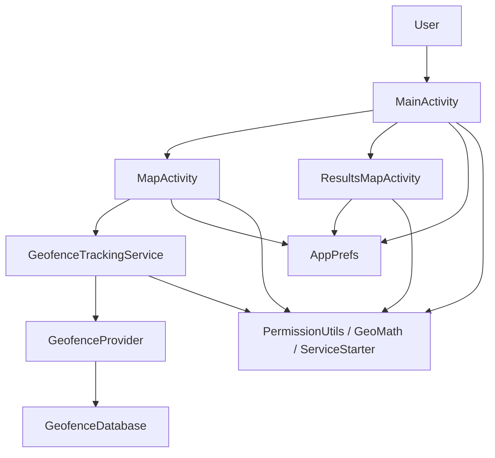
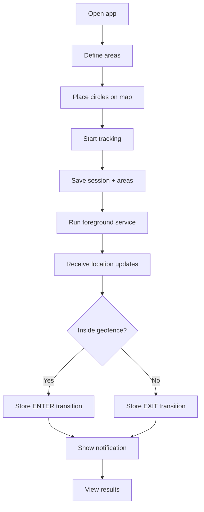
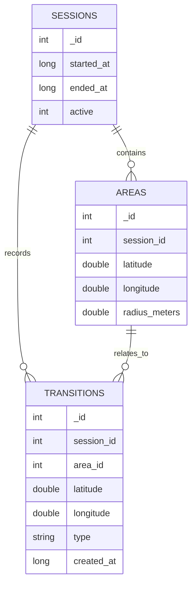
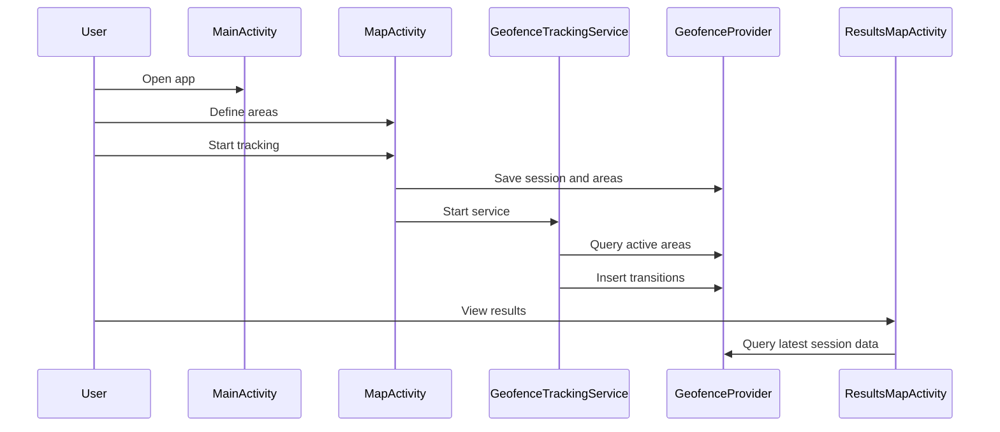

# Geofence_Tracker Project Report

## 1. Introduction

Geofence_Tracker is a native Android application written in Java for defining geofence areas, monitoring movement, recording entry and exit events, and reviewing the latest tracked session on a map.

The project demonstrates:

- Android activity-based navigation
- Google Maps integration
- location permissions and foreground service behavior
- persistent storage using SQLite and a content provider
- emulator and instrumentation testing

## 2. Project Goal

The goal of the application is to let a user:

1. define one or more circular areas on a map
2. start tracking location updates
3. detect when the device enters or exits one of those areas
4. store the results in a database
5. review the latest session on a results map

## 3. High-Level Architecture

The app is split into a few clear layers:

- Presentation layer
  - `MainActivity`
  - `MapActivity`
  - `ResultsMapActivity`
- Tracking layer
  - `GeofenceTrackingService`
  - `GpsStatusReceiver`
  - `ServiceStarter`
- Data layer
  - `GeofenceProvider`
  - `GeofenceDatabase`
  - `GeofenceContract`
- Utility layer
  - `AppPrefs`
  - `PermissionUtils`
  - `GeoMath`

## 4. Functional Flow

The application flow is intentionally simple:

1. The user opens the app.
2. The user chooses to define areas on the map.
3. The user long-presses the map to place one or more 100 meter circles.
4. The user starts tracking.
5. The app saves a new session and the selected areas.
6. The foreground service begins checking device location.
7. Enter and exit transitions are written to the database.
8. The results screen displays the latest session data.

## 5. Screen Descriptions

### 5.1 Main Screen

`MainActivity` is the entry point.

Responsibilities:

- request location permission if needed
- navigate to the map screen
- navigate to the results screen
- stop active tracking
- show a small status summary

### 5.2 Map Screen

`MapActivity` is where the user defines geofence areas.

Responsibilities:

- show a Google Map
- let the user place circles with a long press
- remove a circle by long pressing inside it
- create a new tracking session
- save the selected areas
- start the tracking service

### 5.3 Results Screen

`ResultsMapActivity` shows the last recorded session.

Responsibilities:

- draw saved geofence circles
- show transition markers
- show the current location when available
- support pause and resume of tracking
- show a clear empty state when no results exist

## 6. Data Model

### Sessions

Each tracking run is stored as a session.

Fields:

- `_ID`
- `started_at`
- `ended_at`
- `active`

### Areas

Each session can contain multiple geofence areas.

Fields:

- `_ID`
- `session_id`
- `latitude`
- `longitude`
- `radius_meters`

### Transitions

Each time the device enters or exits a geofence, a transition is stored.

Fields:

- `_ID`
- `session_id`
- `area_id`
- `latitude`
- `longitude`
- `type`
- `created_at`

## 7. Core Logic

### Geofence evaluation

The app uses the Haversine formula to compute distance between the current location and the center of each geofence.

If the distance is less than or equal to the configured radius:

- the device is considered inside the area
- an `ENTER` event may be stored

If the distance becomes greater than the radius:

- the device is considered outside the area
- an `EXIT` event may be stored

### Tracking behavior

The service intentionally filters noisy updates so it does not write too many duplicate events.

### Results behavior

The results screen reads the latest session only, which keeps the UI focused and predictable.

## 8. User Experience Notes

The UI was improved with:

- clearer spacing
- stronger visual hierarchy
- status text on the main screen
- instruction cards on the map screens
- an empty state on the results screen

These changes make the app easier to understand on first launch and less fragile on different screen sizes.

## 9. Testing Strategy

The project includes three useful test levels:

### Unit tests

- Validate pure math logic
- Example: distance calculations

### Provider and instrumentation tests

- Validate database inserts and queries
- Validate session and transition persistence
- Validate latest-session result behavior

### UI flow tests

- Validate that the app navigation works on the emulator
- Validate that the results screen opens from the main screen

## 10. Deployment Notes

Before building or publishing the app, the developer should:

- put the real Maps API key in `local.properties`
- verify Google Play Services is available on the target device
- test location permission flows
- test with GPS enabled and disabled

## 11. Compatibility Notes

The project is designed to work across many Android devices, but real-world behavior still depends on:

- screen size
- font scale
- GPS quality
- Play Services availability
- permission behavior
- battery optimization settings

## 12. Conclusion

Geofence_Tracker is a compact but complete Android geofencing app that demonstrates how to:

- build a user-facing map-based workflow
- monitor location in the background
- persist data reliably
- review historical results
- support automated verification with tests

It is a good example of a structured Android Java project with clear responsibilities and realistic tracking behavior.
