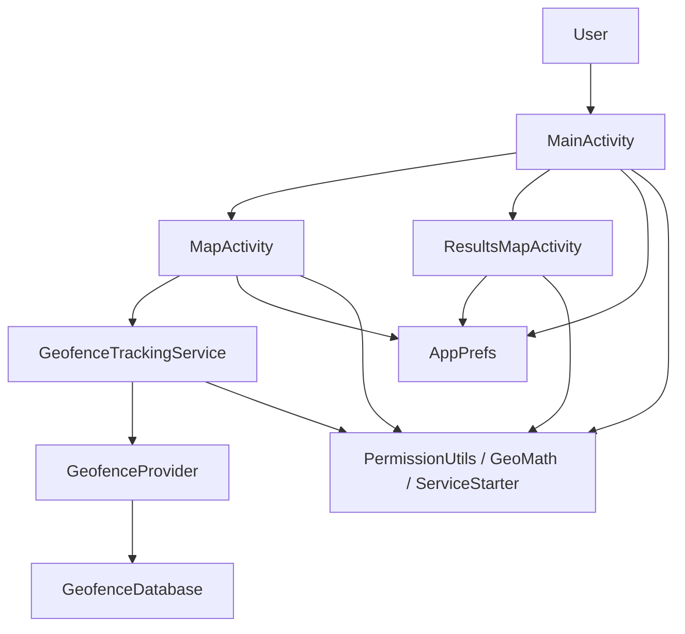
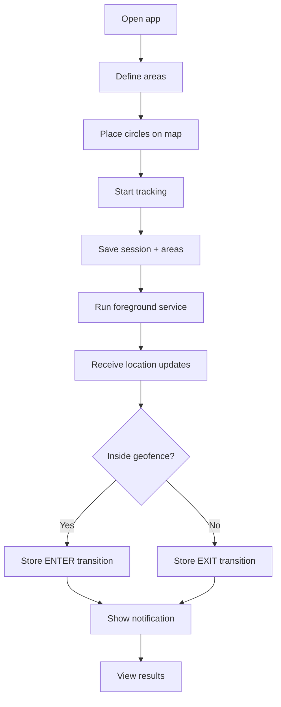
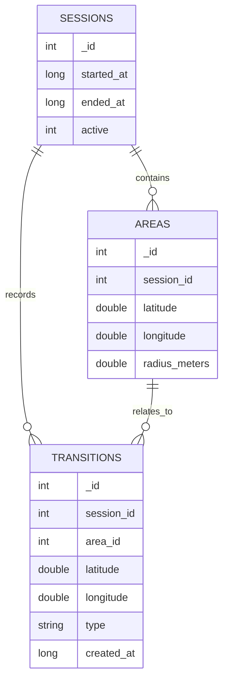
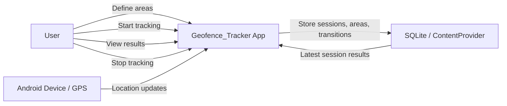
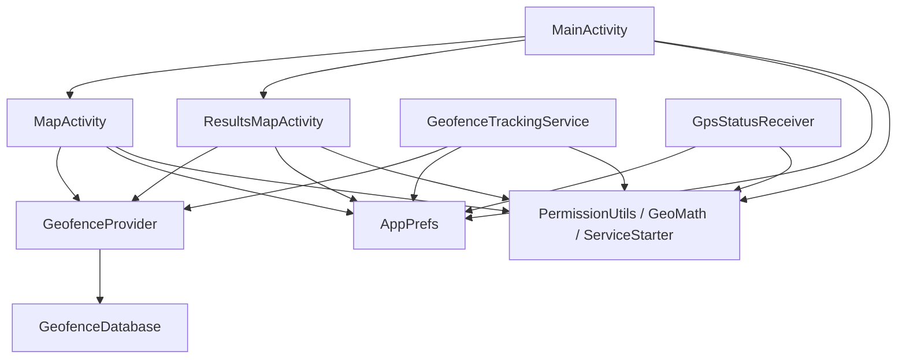
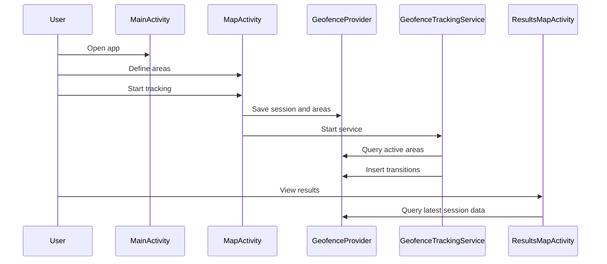
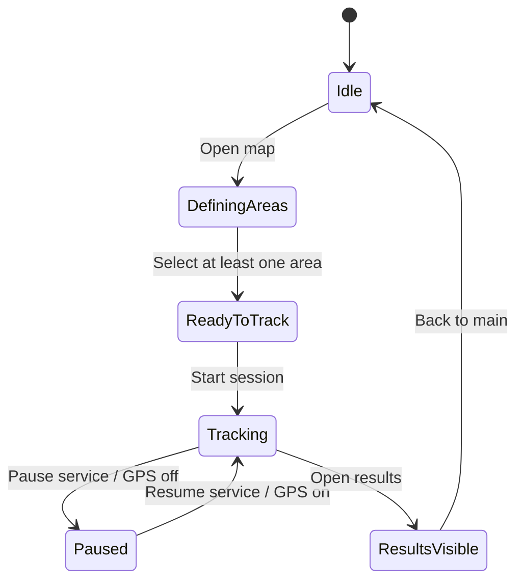
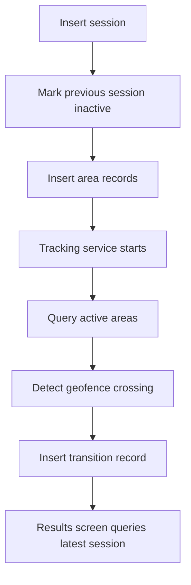

# Geofence_Tracker

## Submission Document

**Course / Project:** Android Geofencing Application  
**Technology:** Android, Java, Google Maps, SQLite  
**Author:** Elvis  
**Date:** 2026-06-28

---

## Abstract

Geofence_Tracker is a native Android application that allows a user to define circular geofence areas on a map, start location tracking, detect entry and exit transitions, and review the latest session results. The application uses a foreground location service, a SQLite-backed content provider, and Google Maps to present and persist geofence activity. It also includes unit tests, provider tests, and emulator-based UI tests to verify core behavior.

---

## Chapter 1. Introduction

### 1.1 Purpose

The purpose of this project is to demonstrate a complete Android geofencing workflow in Java. The app covers the major pieces needed for a practical location-aware mobile application: permissions, map interaction, persistent storage, foreground tracking, transition detection, and results viewing.

### 1.2 Project Scope

The project includes:

- a main screen for navigation and tracking control
- a map screen for defining geofence areas
- a results screen for reviewing stored transitions
- a SQLite database with sessions, areas, and transitions
- a foreground service for geofence monitoring
- automated tests for logic, provider behavior, and UI flow

### 1.3 Main Objective

The main objective is to show how a user can:

1. place one or more circular areas on a map
2. start tracking device movement
3. detect when the device enters or exits those areas
4. store the results
5. review the latest session later

---

## Chapter 2. System Overview

Geofence_Tracker is organized into four major parts:

- presentation layer
- tracking layer
- data layer
- utility layer



---

## Chapter 3. Application Flow

### 3.1 User Flow

1. The user opens the app.
2. The user defines geofence areas on the map.
3. The user starts tracking.
4. The app creates a new session and stores the selected areas.
5. The foreground service monitors location updates.
6. Entry and exit events are saved as transitions.
7. The results screen shows the latest session data.

### 3.2 Functional Flow



---

## Chapter 4. Architecture

### 4.1 Presentation Layer

#### `MainActivity`

Acts as the landing screen.

Responsibilities:

- request location permission when needed
- navigate to the map screen
- navigate to the results screen
- stop tracking
- display a status message

#### `MapActivity`

Lets the user define geofence areas.

Responsibilities:

- show the Google Map
- add circles with a long press
- remove circles by long pressing inside them
- create a session
- save selected areas
- start the tracking service

#### `ResultsMapActivity`

Shows the latest session results.

Responsibilities:

- draw saved geofence circles
- show enter/exit markers
- show the current device location when available
- pause or resume tracking
- display an empty state when no results exist

### 4.2 Tracking Layer

#### `GeofenceTrackingService`

Foreground service that monitors movement.

Responsibilities:

- request location updates
- filter out overly frequent updates
- detect inside/outside changes
- store transitions in the database
- show notifications

#### `GpsStatusReceiver`

Listens for GPS/provider changes.

Responsibilities:

- stop tracking when GPS is disabled
- restart tracking when GPS is enabled again and the app is active

#### `ServiceStarter`

Utility for starting and stopping the foreground service.

### 4.3 Data Layer

#### `GeofenceProvider`

Exposes app data through content URIs.

Responsibilities:

- insert sessions, areas, and transitions
- query current active areas
- query the latest session’s areas
- query the latest session’s transitions

#### `GeofenceDatabase`

Creates and manages the SQLite schema.

#### `GeofenceContract`

Defines table names, column names, URIs, and authority constants.

### 4.4 Utility Layer

#### `AppPrefs`

Stores small persistent flags:

- active session id
- service enabled state

#### `PermissionUtils`

Manages runtime permission checks and requests.

#### `GeoMath`

Implements distance calculation using the Haversine formula.

---

## Chapter 5. Data Model

### 5.1 Sessions

Represents a tracking run.

Fields:

- `_ID`
- `started_at`
- `ended_at`
- `active`

### 5.2 Areas

Represents a geofence circle linked to a session.

Fields:

- `_ID`
- `session_id`
- `latitude`
- `longitude`
- `radius_meters`

### 5.3 Transitions

Represents an enter or exit event.

Fields:

- `_ID`
- `session_id`
- `area_id`
- `latitude`
- `longitude`
- `type`
- `created_at`



---

## Chapter 6. Diagrams

### 6.1 Use Case Diagram



### 6.2 Component Diagram



### 6.3 Sequence Diagram



### 6.4 State Diagram



### 6.5 Database Flow



---

## Chapter 7. Testing

The project includes:

- unit tests for math logic
- provider tests for database behavior
- instrumentation tests for emulator-based flow validation

### 7.1 Unit Tests

- `GeoMathTest`

Validates:

- same-point distance
- symmetry
- approximate threshold behavior

### 7.2 Provider Tests

- `GeofenceProviderTest`

Validates:

- session insertion
- area insertion
- transition insertion
- latest session queries
- repeated movement behavior

### 7.3 UI Flow Tests

- `ResultsMapActivityTest`
- `AppFlowResultsUiTest`

Validates:

- opening the results screen from the main flow
- visible UI state
- latest session data availability

---

## Chapter 8. Requirements and Notes

### 8.1 Runtime Requirements

- Android 6.0 or newer
- Google Play Services
- Google Maps API key
- location permission
- notification permission on Android 13+

### 8.2 Security Notes

The Google Maps API key is not stored in source control. It should be supplied locally in `local.properties`:

```properties
MAPS_API_KEY=YOUR_REAL_KEY
```

### 8.3 Compatibility Notes

The app is designed to be lightweight and broadly compatible, but actual behavior depends on:

- GPS availability
- Play Services
- permission grants
- screen size and font scaling
- device battery policies

---

## Chapter 9. Conclusion

Geofence_Tracker demonstrates a complete Android geofencing workflow in Java. It combines map-based interaction, a foreground tracking service, persistent storage, results visualization, and automated testing into a compact project structure. The codebase is intentionally organized to be understandable, maintainable, and suitable for demonstration or academic submission.

---

## References

- Android Developers documentation
- Google Maps Platform documentation
- AndroidX Test documentation
- SQLite and ContentProvider concepts in Android
- Haversine formula for distance calculation
- Project source code in this repository

