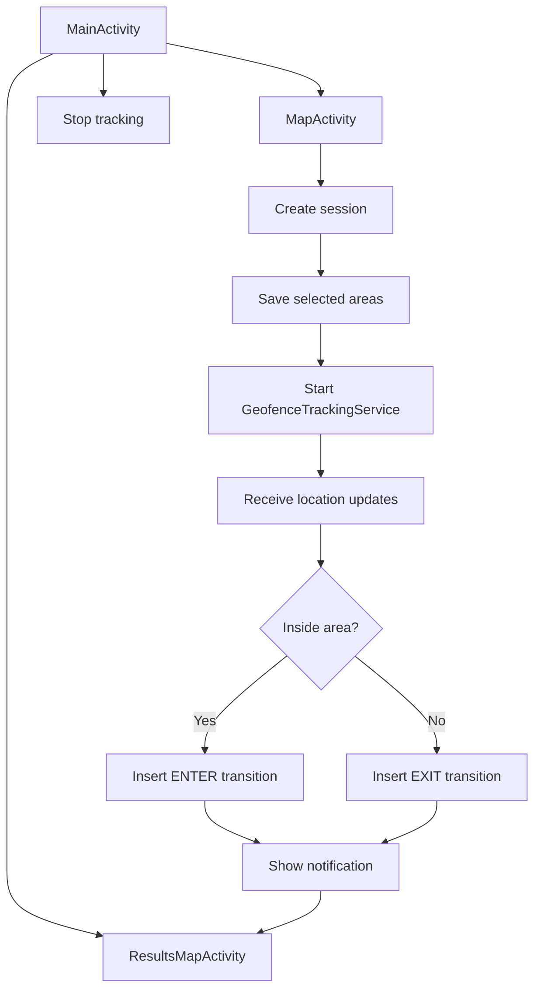
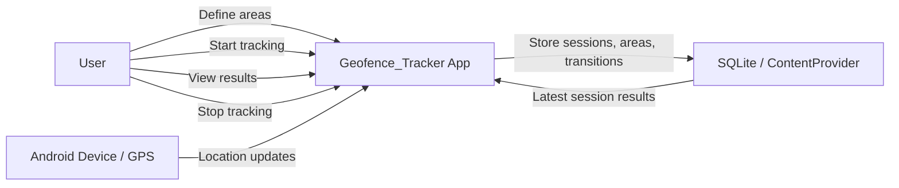
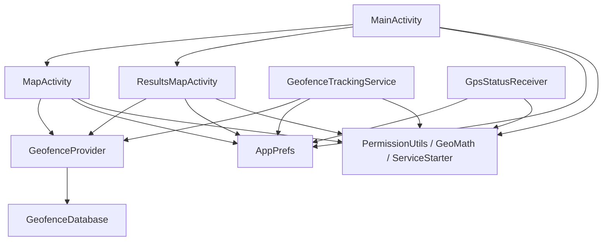
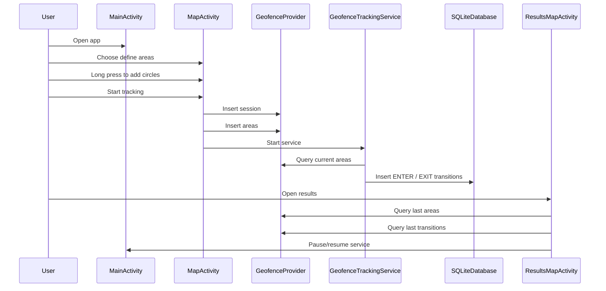
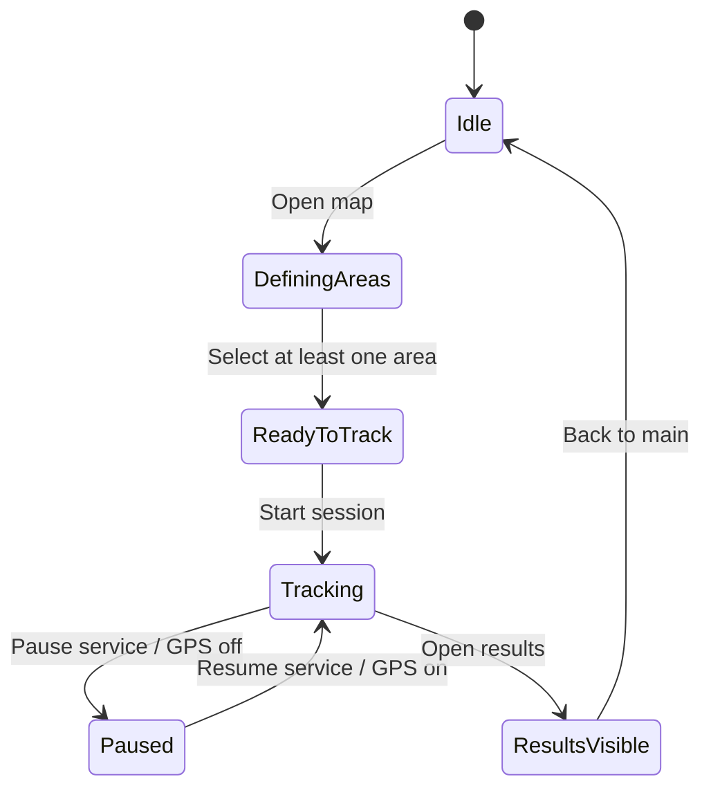
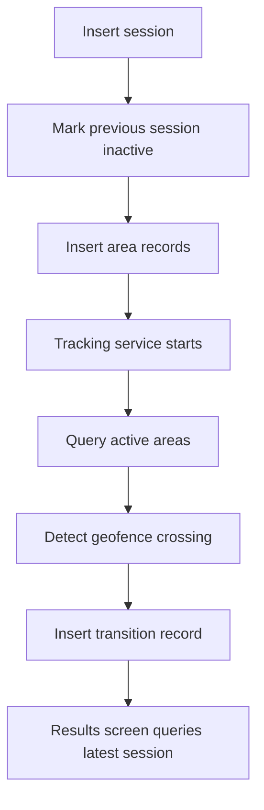

# Geofence_Tracker Project Documentation

## Overview

Geofence_Tracker is an Android app written in Java that lets a user define circular geofence areas, start location tracking, detect entry and exit transitions, and review the latest session results on a map.

The project is organized as a small but complete Android application with:

- a main screen for navigation and tracking control
- a map screen for defining geofence areas
- a results screen for reviewing saved geofence activity
- a SQLite-backed content provider for sessions, areas, and transitions
- a foreground location service for geofence monitoring
- a few utility classes for permissions, math, and app preferences
- emulator and provider-based tests for core behavior

## What The App Does

At a high level:

1. The user opens the app.
2. The user creates one or more circular geofence areas on the map.
3. The user starts tracking.
4. The foreground service listens for location changes.
5. When the device moves into or out of a selected area, the app stores a transition in the database.
6. The results screen shows the latest session’s areas and transition markers.

## Project Structure

### `MainActivity`

File:

- [MainActivity.java](app\src\main\java\com\example\geofenceapp\MainActivity.java)

What it does:

- Acts as the landing screen
- Requests foreground location permission when needed
- Navigates to the map screen and results screen
- Stops active tracking sessions
- Shows a small status area so the user can see the current state

### `MapActivity`

File:

- [MapActivity.java](app\src\main\java\com\example\geofenceapp\MapActivity.java)

What it does:

- Shows the Google Map where the user defines geofence areas
- Long press adds a 100 meter circle
- Long press inside an existing circle removes it
- Saves the selected areas as part of a new session
- Starts the tracking service

### `ResultsMapActivity`

File:

- [ResultsMapActivity.java](app\src\main\java\com\example\geofenceapp\ResultsMapActivity.java)

What it does:

- Shows the latest saved session on a map
- Draws saved geofence circles
- Places enter/exit markers for the latest session
- Shows the current device location when available
- Lets the user pause or resume the tracking service
- Shows an empty state when there are no results yet

### `GeofenceTrackingService`

File:

- [GeofenceTrackingService.java](app\src\main\java\com\example\geofenceapp\location\GeofenceTrackingService.java)

What it does:

- Runs as a foreground service
- Requests location updates from Google Play Services
- Filters out updates that are too close or too soon
- Checks whether the current location is inside any active area
- Logs `ENTER` and `EXIT` transitions into the database
- Shows a notification when entry or exit happens

### `ServiceStarter`

File:

- [ServiceStarter.java](app\src\main\java\com\example\geofenceapp\location\ServiceStarter.java)

What it does:

- Starts the tracking service
- Stops the tracking service
- Handles the difference between pre-Oreo and modern Android service startup behavior

### `GpsStatusReceiver`

File:

- [GpsStatusReceiver.java](app\src\main\java\com\example\geofenceapp\location\GpsStatusReceiver.java)

What it does:

- Listens for GPS/provider changes
- Stops tracking when GPS is unavailable
- Restarts tracking when GPS comes back and the app was enabled

### `GeofenceProvider`

File:

- [GeofenceProvider.java](app\src\main\java\com\example\geofenceapp\data\GeofenceProvider.java)

What it does:

- Exposes app data through a content provider
- Stores and queries:
  - sessions
  - areas
  - transitions
- Provides helper queries for:
  - current active areas
  - latest session areas
  - latest session transitions

### `GeofenceDatabase`

File:

- [GeofenceDatabase.java](app\src\main\java\com\example\geofenceapp\data\GeofenceDatabase.java)

What it does:

- Creates the SQLite tables
- Defines the schema for sessions, areas, and transitions
- Handles database versioning

### `GeofenceContract`

File:

- [GeofenceContract.java](app\src\main\java\com\example\geofenceapp\data\GeofenceContract.java)

What it does:

- Defines the provider authority
- Defines table names and column names
- Defines content URIs used by the app

### `AppPrefs`

File:

- [AppPrefs.java](app\src\main\java\com\example\geofenceapp\util\AppPrefs.java)

What it does:

- Stores simple app state in shared preferences
- Tracks the active session id
- Tracks whether tracking is enabled

### `PermissionUtils`

File:

- [PermissionUtils.java](app\src\main\java\com\example\geofenceapp\util\PermissionUtils.java)

What it does:

- Checks if fine location permission is granted
- Requests foreground location permission
- Requests notification permission on Android 13+

### `GeoMath`

File: `app/src/main/java/com/example/geofenceapp/util/GeoMath.java`

What it does:

- Implements the Haversine formula
- Computes distance in meters between two coordinates
- Powers the inside/outside geofence checks

### `AuthManager`

File: `app/src/main/java/com/example/geofenceapp/util/AuthManager.java`

What it does:

- Central authentication controller
- Handles signup (with validation), login (with token generation), and logout
- Seeds the default admin account on first launch
- Restores the in-memory session from SharedPreferences after a process restart
- Checks whether the current user has the admin role

### `AuthSession`

File: `app/src/main/java/com/example/geofenceapp/util/AuthSession.java`

What it does:

- Holds the currently logged-in user's username and token in static fields
- Used by GeofenceProvider to scope all database queries to the current user
- Cleared on logout, restored from SharedPreferences on app restart

### `PasswordHasher`

File: `app/src/main/java/com/example/geofenceapp/util/PasswordHasher.java`

What it does:

- Hashes passwords using PBKDF2-WithHmacSHA256 (12,000 iterations, 256-bit key)
- Generates cryptographically secure 16-byte random salts
- Verifies a plaintext password against a stored salt and hash

### `LoginActivity`

File: `app/src/main/java/com/example/geofenceapp/LoginActivity.java`

What it does:

- Shows the login form (username + password)
- Authenticates via AuthManager.login()
- Includes a "Don't have an account? Sign up" navigation link
- Shows error message on failed login

### `SignupActivity`

File: `app/src/main/java/com/example/geofenceapp/SignupActivity.java`

What it does:

- Shows the signup form (username + password + confirm password)
- Validates that passwords match before calling AuthManager.signUp()
- Auto-logs in after successful registration
- Includes an "Already have an account? Log in" navigation link

### `AdminActivity`

File: `app/src/main/java/com/example/geofenceapp/AdminActivity.java`

What it does:

- Admin-only screen for user and pin management
- Blocks non-admin users with a toast and finish()
- Manages users: add, delete (admin self-deletion blocked), reset password
- Manages pins: add/remove geofence pins assigned to a target user
- Displays user list with roles and pin counts

## UI Screens

### Main Screen

Purpose:

- Entry point for the user
- Gives access to defining areas, stopping tracking, and viewing results

### Map Screen

Purpose:

- Lets the user place geofence circles
- Starts tracking after the user confirms the selected areas

### Results Screen

Purpose:

- Shows what happened in the latest session
- Displays circles and transition markers
- Provides pause/resume control for the service

## Data Model

### Sessions

Stores tracking runs. Each session is scoped to one user.

Fields:

- `_ID`
- `username` (owner — foreign key to users)
- `started_at`
- `ended_at`
- `active`

### Areas

Stores the geofence circles selected for a session. Scoped to the owning user.

Fields:

- `_ID`
- `username` (owner — foreign key to users)
- `session_id`
- `latitude`
- `longitude`
- `radius_meters`

### Transitions

Stores entry and exit points. Scoped to the owning user.

Fields:

- `_ID`
- `username` (owner — foreign key to users)
- `session_id`
- `area_id`
- `latitude`
- `longitude`
- `type` (ENTER or EXIT)
- `created_at`

### Users

Stores accounts for authentication and authorization.

Fields:

- `_ID`
- `username` (unique)
- `password_hash` (PBKDF2-WithHmacSHA256, 12000 iterations)
- `password_salt` (per-user random salt)
- `auth_token` (issued on login, cleared on logout)
- `role` (`admin`, `user`, or `guest`)
- `created_at`

### Pins

Admin-managed geofence pins assigned to a user.

Fields:

- `_ID`
- `username` (owner)
- `label`
- `latitude`
- `longitude`
- `radius_meters`
- `active`
- `created_at`

## Accounts & Administration

The app has a username/password account system.

- **Sign up / Log in** — `SignupActivity` uses its own `activity_signup.xml` layout with a password confirmation field; `LoginActivity` uses `activity_auth.xml`. Both screens include navigation links ("Already have an account? Log in" / "Don't have an account? Sign up") to switch between them. Sign-up requires a non-empty username and a password of at least 6 characters; passwords are stored only as a salted PBKDF2-WithHmacSHA256 hash (12,000 iterations, 256-bit key, 16-byte random salt via `PasswordHasher`). A successful login issues a random `auth_token` (UUID + SecureRandom), persists it in `AppPrefs`, and sets the in-memory `AuthSession`.
- **Session handling** — `AuthSession` holds the current username/token in memory. `AuthManager.restoreSession` re-hydrates it from `AppPrefs` on app start (in `MainActivity`) so the session survives a process restart. `GeofenceProvider` scopes every query/insert to `AuthSession.username()`, so each user only sees their own sessions, areas, transitions, and pins.
- **Button visibility** — `MainActivity` dynamically shows/hides auth buttons based on login state. Guests see Log In + Sign Up; logged-in users see Log Out; admins additionally see the Admin Panel button. This updates on login, logout, and when returning from other screens (in `onResume`).
- **Admin account** — A seed admin (`admin1404` / `admin1404`, role `admin`) is created both in `GeofenceDatabase.onCreate` and defensively via `AuthManager.ensureSeedAdmin`. Only an admin sees a working **Admin panel** button (guarded by `AuthManager.isAdmin`).
- **Admin panel** — `AdminActivity` (`activity_admin.xml`) lets an admin:
  - Add new user accounts
  - Delete user accounts (with a safety guard that prevents deleting the admin account)
  - Reset any user's password (generates new salt and hash, clears their auth token to force re-login)
  - Add/remove geofence pins assigned to a target user
  - View all users with their roles and pin counts (e.g., "admin1404 (admin) — 0 pins")
  - View detailed pin list (label, coordinates, radius) for a target user
  - Non-admins are rejected with a toast and the screen finishes.

## Application Flow



## Use Case Diagram



## Component Diagram



## Sequence Diagram



## State Diagram



## Database Flow



## Database Migration Strategy

The database uses incremental `ALTER TABLE` migrations instead of dropping and recreating tables, so existing user data is preserved across app updates.

Version history:
- **Version 1**: Initial schema (sessions, areas, transitions)
- **Version 2**: Added `users` and `pins` tables; added `username` column to sessions, areas, and transitions via `ALTER TABLE` (existing rows default to `'guest'`)
- **Version 3**: Re-seeds the admin account to ensure it exists after migrations

The `addUsernameColumnIfMissing()` method uses `PRAGMA table_info()` to inspect the current schema before altering, making migrations safe to re-run.

## Logging

All Java files include `android.util.Log` calls with proper log tags and levels:

- `Log.i` (info): login, logout, signup, session creation, ENTER/EXIT transitions, service start/stop, GPS state changes, DB migrations, user/pin management
- `Log.d` (debug): activity lifecycle (`onCreate`), camera moves, area add/remove, location processing
- `Log.w` (warning): failed login, rejected signup (duplicate, short password), blocked admin self-deletion, missing permissions
- `Log.e` (error): password hashing failures

Each class uses a `TAG` constant matching its class name. Filter logs with:

```
adb logcat -s AuthManager GeofenceProvider GeofenceTrackingService MainActivity AdminActivity LoginActivity SignupActivity GpsStatusReceiver ServiceStarter GeofenceDatabase
```

## Testing Coverage

**20 tests total** — 16 instrumentation tests (require emulator/device) + 4 unit tests (JVM).

### Unit Tests (4)

- `GeoMathTest`
  - same-point distance is zero
  - Athens-to-Piraeus distance is approximately 8.5 km
  - distance calculation is symmetric
  - 100-meter threshold boundary behavior

### Account Tests (8)

- `AuthManagerTest`
  - seed admin account is created and can log in with admin role
  - signup, login, and logout work for a regular user
  - `restoreSession` re-hydrates a logged-in user after a simulated process restart
  - wrong password is rejected
  - short password (under 6 chars) is rejected
  - regular user is not granted admin access
  - duplicate usernames are rejected
  - provider correctly stores and retrieves user records

### Provider Tests (5)

- `GeofenceProviderTest`
  - session and area insert, current areas query
  - movement sequence with 5 transitions, last queries return correct data
  - repeated same-side movements do not produce incorrect counts
  - latest session is what results queries return (multi-session test)
  - transition insert with enter and exit points
- `PinProviderTest`
  - pin insert and delete scoped to a specific user

### UI / App Flow Tests (3)

- `ResultsMapActivityTest`
  - results screen launches with seeded multi-session data, shows correct session
- `AppFlowResultsUiTest`
  - main screen → results screen navigation with login
  - latest session data is visible in results

## Runtime Requirements

- Android 6.0+ (`minSdk 23`)
- Google Play Services
- Google Maps API key
- Location permission
- Notification permission on Android 13+
- GPS enabled for actual tracking behavior

## Notes For Real Devices

The app should run on a broad range of Android devices, but real-world behavior depends on:

- GPS accuracy
- Play Services availability
- permission grants
- battery optimization policies
- map rendering support
- screen size and font scaling

## Security Note

The Google Maps API key is not stored in source control. It is expected to live in `local.properties` as:

```properties
MAPS_API_KEY=YOUR_REAL_KEY
```

## Summary

This project is a compact geofence tracker that demonstrates:

- Android activity navigation
- map-based user input
- location tracking
- SQLite persistence through a content provider
- foreground service behavior
- emulator and instrumentation testing

It is small enough to understand quickly, but complete enough to serve as a good Android learning project or assignment baseline.
