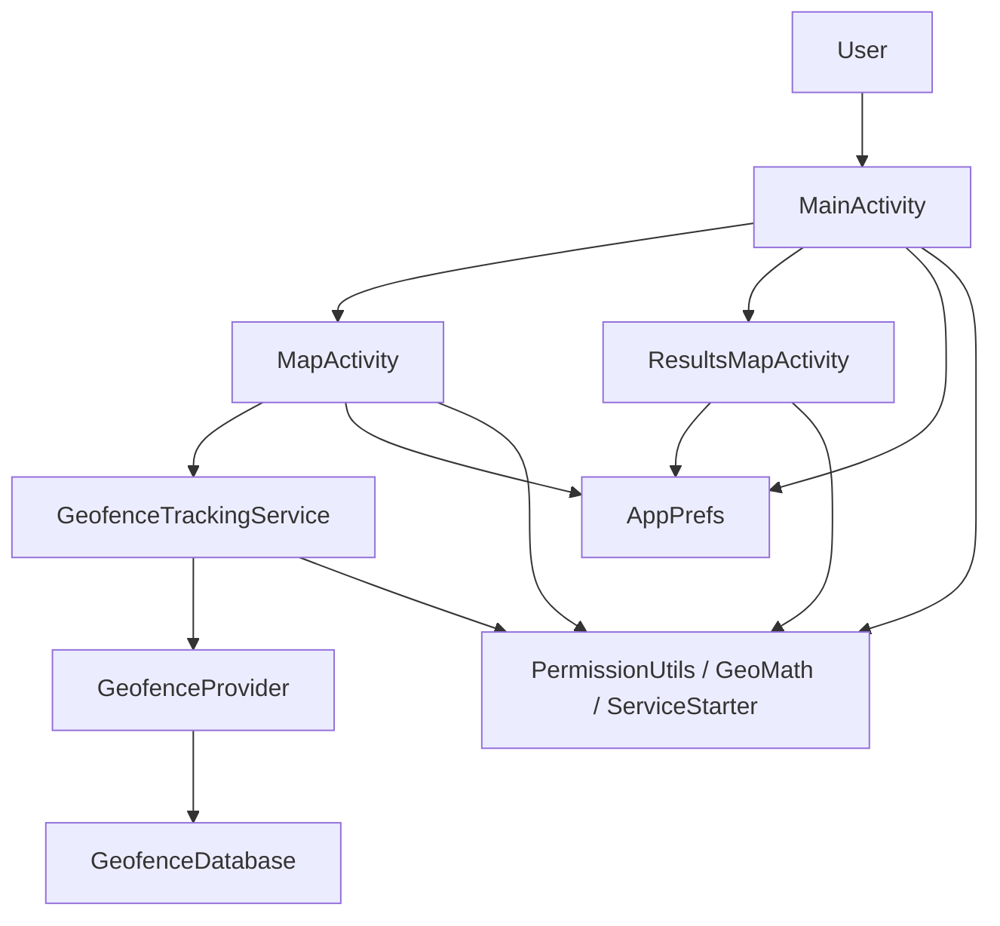
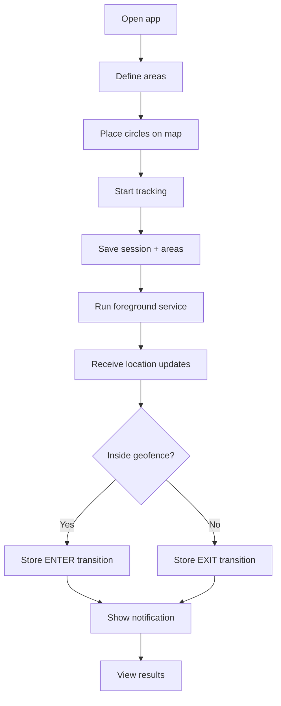
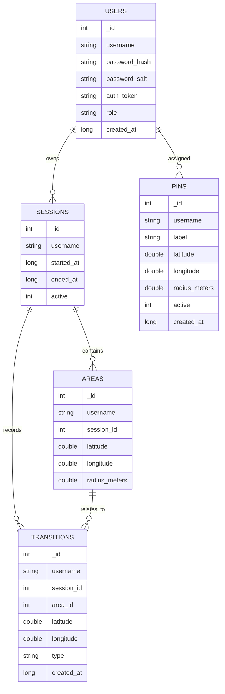
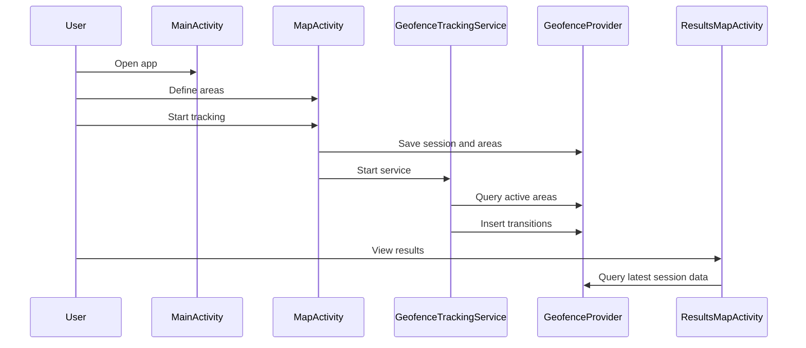

# Geofence_Tracker Project Report

## 1. Introduction

Geofence_Tracker is a native Android application written in Java for defining geofence areas, monitoring movement, recording entry and exit events, and reviewing the latest tracked session on a map.

The project demonstrates:

- Android activity-based navigation
- Google Maps integration
- location permissions and foreground service behavior
- persistent storage using SQLite and a content provider
- emulator and instrumentation testing

## 2. Project Goal

The goal of the application is to let a user:

1. define one or more circular areas on a map
2. start tracking location updates
3. detect when the device enters or exits one of those areas
4. store the results in a database
5. review the latest session on a results map

## 3. High-Level Architecture

The app is split into a few clear layers:

- Presentation layer
  - `MainActivity`
  - `MapActivity`
  - `ResultsMapActivity`
  - `LoginActivity`
  - `SignupActivity`
  - `AdminActivity`
- Tracking layer
  - `GeofenceTrackingService`
  - `GpsStatusReceiver`
  - `ServiceStarter`
- Data layer
  - `GeofenceProvider`
  - `GeofenceDatabase`
  - `GeofenceContract`
- Utility layer
  - `AppPrefs`
  - `PermissionUtils`
  - `GeoMath`
  - `AuthManager`
  - `AuthSession`
  - `PasswordHasher`

## 4. Functional Flow

The application flow is intentionally simple:

1. The user opens the app.
2. The user chooses to define areas on the map.
3. The user long-presses the map to place one or more 100 meter circles.
4. The user starts tracking.
5. The app saves a new session and the selected areas.
6. The foreground service begins checking device location.
7. Enter and exit transitions are written to the database.
8. The results screen displays the latest session data.

## 5. Screen Descriptions

### 5.1 Main Screen

`MainActivity` is the entry point.

Responsibilities:

- request location permission if needed
- navigate to the map screen
- navigate to the results screen
- stop active tracking
- show a small status summary

### 5.2 Map Screen

`MapActivity` is where the user defines geofence areas.

Responsibilities:

- show a Google Map
- let the user place circles with a long press
- remove a circle by long pressing inside it
- create a new tracking session
- save the selected areas
- start the tracking service

### 5.3 Results Screen

`ResultsMapActivity` shows the last recorded session.

Responsibilities:

- draw saved geofence circles
- show transition markers
- show the current location when available
- support pause and resume of tracking
- show a clear empty state when no results exist

## 6. Data Model

### Sessions

Each tracking run is stored as a session, scoped to one user.

Fields:

- `_ID`
- `username` (owner — foreign key to users)
- `started_at`
- `ended_at`
- `active`

### Areas

Each session can contain multiple geofence areas. Scoped to the owning user.

Fields:

- `_ID`
- `username` (owner — foreign key to users)
- `session_id`
- `latitude`
- `longitude`
- `radius_meters`

### Transitions

Each time the device enters or exits a geofence, a transition is stored. Scoped to the owning user.

Fields:

- `_ID`
- `username` (owner — foreign key to users)
- `session_id`
- `area_id`
- `latitude`
- `longitude`
- `type` (ENTER or EXIT)
- `created_at`

### Users and Pins

The accounts system adds two more tables. `Users` holds credentials and roles; `Pins` holds admin-assigned geofence points scoped to a user.

Fields (`Users`): `_ID`, `username` (unique), `password_hash`, `password_salt`, `auth_token`, `role`, `created_at`.

Fields (`Pins`): `_ID`, `username`, `label`, `latitude`, `longitude`, `radius_meters`, `active`, `created_at`.

## 6b. Accounts & Administration

The app supports per-user accounts with hashed passwords and an admin role.

- **Authentication** — `SignupActivity` has its own layout (`activity_signup.xml`) with a password confirmation field. `LoginActivity` uses `activity_auth.xml`. Both include navigation links ("Already have an account? Log in" / "Don't have an account? Sign up"). `PasswordHasher` stores passwords as a salted PBKDF2-WithHmacSHA256 hash (12,000 iterations, 256-bit key, 16-byte random salt — never plaintext). Login issues a random `auth_token` (UUID + SecureRandom), persisted in `AppPrefs` and held in `AuthSession`.
- **Session restore** — `AuthManager.restoreSession` (called from `MainActivity.onCreate` and `onResume`) re-loads the saved session from SharedPreferences into `AuthSession` after a process restart, so data stays scoped to the correct user. Without this, `AuthSession.username()` would revert to `"guest"` and the ContentProvider would scope data to the wrong user.
- **Button visibility** — `MainActivity` dynamically toggles button visibility: guests see Log In + Sign Up; regular users see Log Out only; admins see Log Out + Admin Panel. The toggle runs on `onCreate`, `onResume`, and after logout.
- **Admin account** — A seed admin (`admin1404` / `admin1404`) is inserted by `GeofenceDatabase.seedAdmin` and re-checked by `AuthManager.ensureSeedAdmin`.
- **Admin panel** — `AdminActivity` lets the admin:
  - Add/delete users (admin self-deletion is blocked)
  - Reset any user's password (new salt + hash, clears token to force re-login)
  - Add/remove geofence pins for a target user
  - View all users with roles and pin counts
  - View detailed pin list for a target user
  - Non-admins are rejected with a toast and `finish()`

## 7. Core Logic

### Geofence evaluation

The app uses the Haversine formula to compute distance between the current location and the center of each geofence.

If the distance is less than or equal to the configured radius:

- the device is considered inside the area
- an `ENTER` event may be stored

If the distance becomes greater than the radius:

- the device is considered outside the area
- an `EXIT` event may be stored

### Tracking behavior

The service intentionally filters noisy updates so it does not write too many duplicate events.

### Results behavior

The results screen reads the latest session only, which keeps the UI focused and predictable.

## 7b. Database Migration

The database uses incremental `ALTER TABLE` migrations (not drop-and-recreate), preserving existing data:

- **v1 → v2**: Creates `users` and `pins` tables; adds `username` column to existing `sessions`, `areas`, and `transitions` tables (default `'guest'` for old rows)
- **v2 → v3**: Re-seeds the admin account to ensure it exists after migration

The migration uses `PRAGMA table_info()` to check if columns already exist before altering.

## 7c. Logging

All Java files use `android.util.Log` with proper tag constants and log levels:

- `Log.i`: important events (login, logout, signup, transitions, service lifecycle, DB migrations)
- `Log.d`: debug details (onCreate, location processing, area toggles)
- `Log.w`: warnings (failed auth, blocked operations, missing permissions)
- `Log.e`: errors (hashing failures)

Logs can be filtered with: `adb logcat -s AuthManager GeofenceProvider GeofenceTrackingService MainActivity AdminActivity`

## 8. User Experience Notes

The UI was improved with:

- clearer spacing
- stronger visual hierarchy
- status text on the main screen
- instruction cards on the map screens
- an empty state on the results screen

These changes make the app easier to understand on first launch and less fragile on different screen sizes.

## 9. Testing Strategy

The project includes **20 tests** across four levels (16 instrumentation + 4 unit):

### Unit tests (4 tests — `GeoMathTest`)

- Same-point distance is zero
- Athens-to-Piraeus distance is approximately 8.5 km
- Distance calculation is symmetric (A→B = B→A)
- 100-meter threshold boundary check

### Account tests (8 tests — `AuthManagerTest`)

- Seed admin account is created and can log in with admin role
- Signup, login, and logout work for a regular user
- `restoreSession` re-hydrates a logged-in user after simulated process restart
- Wrong password is rejected
- Short password (under 6 characters) is rejected
- Regular user is not granted admin access
- Duplicate usernames are rejected
- Provider correctly stores and retrieves user records by username

### Provider tests (5 tests — `GeofenceProviderTest` + `PinProviderTest`)

- Session and area insert; current areas query returns correct data
- 5-transition movement sequence; last queries return correct areas and transitions
- Repeated same-side movements are stored without error
- Latest session is what results queries return (multi-session test)
- Pin insert and delete scoped to a specific user

### UI flow tests (3 tests — `ResultsMapActivityTest` + `AppFlowResultsUiTest`)

- Results screen launches with seeded multi-session data, shows correct session
- Main screen → results screen navigation with logged-in user
- Latest session data is visible in results query

## 10. Deployment Notes

Before building or publishing the app, the developer should:

- put the real Maps API key in `local.properties`
- verify Google Play Services is available on the target device
- test location permission flows
- test with GPS enabled and disabled

## 11. Compatibility Notes

The project is designed to work across many Android devices, but real-world behavior still depends on:

- screen size
- font scale
- GPS quality
- Play Services availability
- permission behavior
- battery optimization settings

## 12. Conclusion

Geofence_Tracker is a compact but complete Android geofencing app that demonstrates how to:

- build a user-facing map-based workflow
- monitor location in the background
- persist data reliably
- review historical results
- support automated verification with tests

It is a good example of a structured Android Java project with clear responsibilities and realistic tracking behavior.
